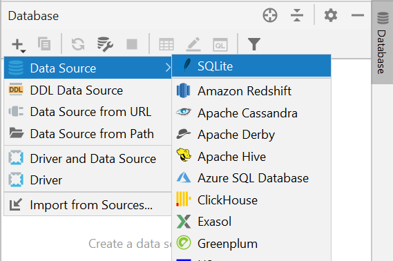
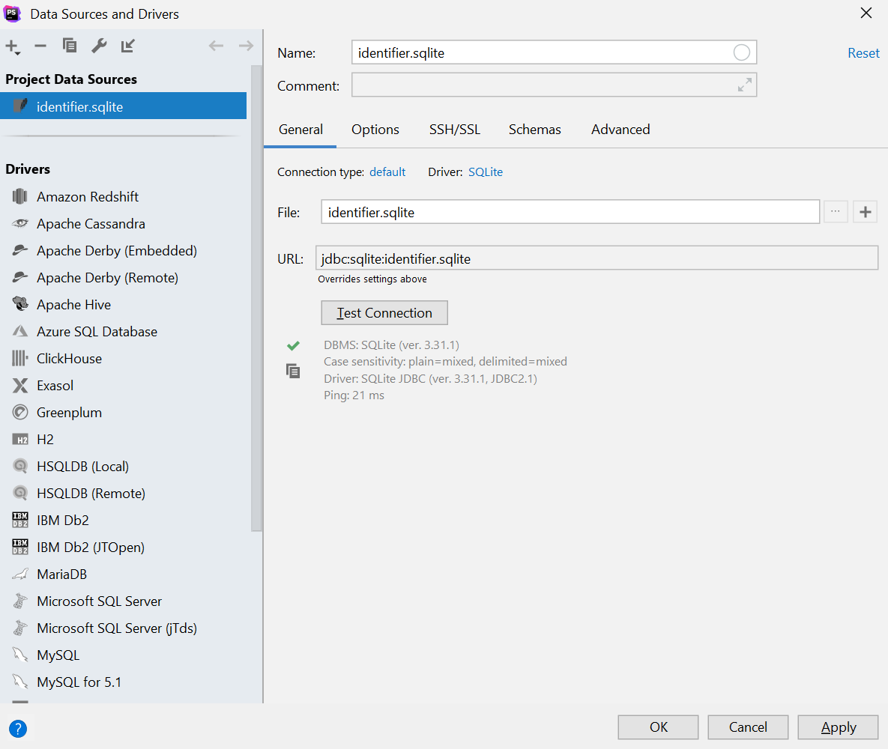
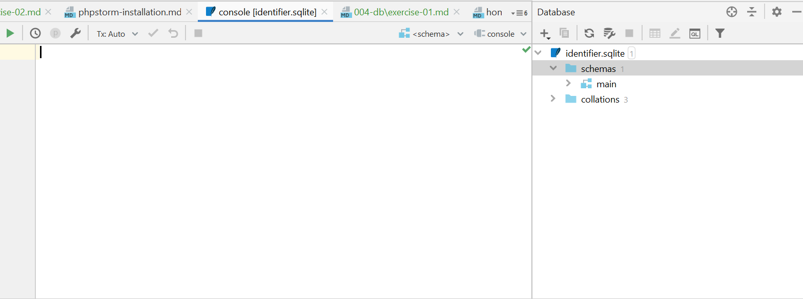

# Работа с SQLite в PhpStorm

### Шаг 1 
Для начала находим справа на панели Database и нажимаем на неё. Под + надо выбрать Data Source -> SQLite.

### Шаг 2 
Далее откроется окно с настройками, они будут дефолтные. Выглядеть будут примерно так:

Для полной уверенности можно нажать Test Connection — он покажет нам, работает ли соединение. Также там можно будет посмотреть
опции подключения для PHP-кода.

Нажимаем Apply — применить настройки.

### Шаг 3 
У нас теперь открывается отдельным файлом консоль для работы с базой данных SQLite и справа — структура базы данных и таблиц.
Для того, чтобы открыть данные в таблице, можно дважды нажать на её название.

В этой консоли можно тренироваться на SQL-запросах и наблюдать их результаты внизу или же в каждой таблице отдельно.
Базу данных создать, к сожалению, не удастся, зато получится посмотреть результаты работы с таблицами и данными.
